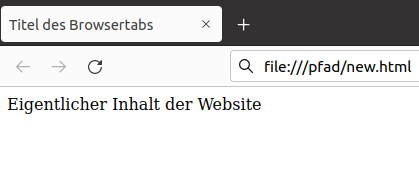

# HTML: Grundstruktur

## Grundstruktur

Wir haben bisher nur unvollständige HTML-Dokumente geschrieben. Der Browser hat diese selbst vervollständigt und konnte sie so anzeigen. Um die volle Kontrolle zu haben, schreibst du selbst ein Grundgerüst.

<playground-html-css>

</playground-html-css>

Wenn wir diese Grundstruktur in einer Datei `new.html` speichern und
diese mit einem Browser öffnen, ist Folgendes zu sehen:

Alle HTML-Elemente, die du bis jetzt kennengelernt hast, schreibt man
zwischen `<body>` und `</body>`.

| Tag | Bedeutung |
|:---|:---|
| `<!DOCTYPE html>` | Informiert den Browser über den Typ des Dokuments |
| `<html lang = "de">` | Festlegung der Sprache. Der Inhalt ist der gesamte HTML-Code |
| `<meta charset= "utf-8" >` | Festlegung der Kodierung. Ermöglicht zum Beispiel die Verwendung von Umlauten |
| `<title>` | Titel des Browsertabs |
| `<head>` | Der Inhalt enthält Informationen über die Website, aber keine sichtbaren Elemente |
| `<body>` | Der Inhalt enthält alle HTML-Elemente, die auf der Website zu sehen sind |

